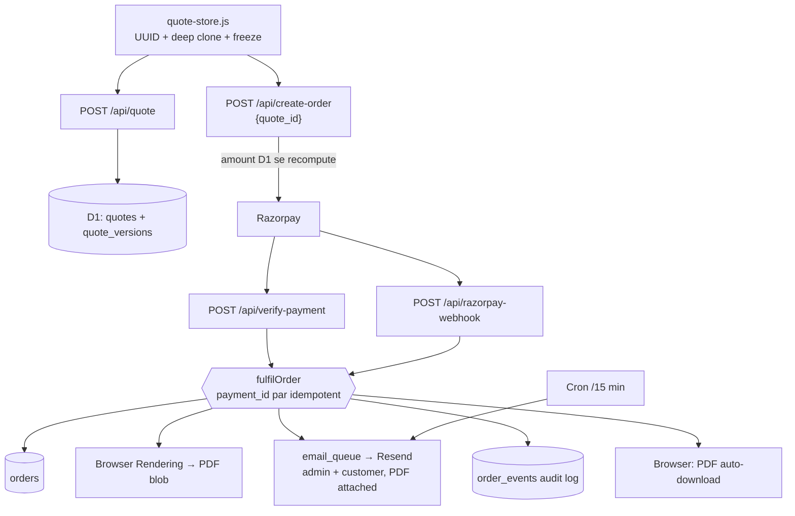

# Quotation & Order System Stability — Final Report

Do cheezein theek ki gayi hain: **quotation items ka aapas me mix hona**, aur **paid order ke baad PDF/email ka na aana**. Dono ke root cause alag the, aur dono ab code me band hain.

---

## 1. Bugs, root causes aur fix

### A. Product data mixing — asli wajah storage nahi, **export-time re-hydration** thi

Ye sabse important finding hai. Cart sheet me values **hamesha sahi dikhti thi**, kyunki wo stored `details` seedha render karti hai. Galat values sirf **PDF aur email me** aati thi, kyunki wo raasta `enrichCartItemForPrint()` se guzarta hai.

`enrichWindowCartItem` / `enrichPergolaCartItem` / `enrichMirrorCartItem` / `enrichGlassRailingCartItem` — chaaron me ek "live page" branch tha jo saved item ke **dimensions, material, rate aur total ko current page ki live calculator state se replace** kar deta tha, jab `cartItemMatchesLivePage(it)` true hota.

Aur wo check hi toota hua tha:

```js
if (it.productKey && meta.key && it.productKey === meta.key) return true;
```

Pathname compare hota hi nahi tha — sirf `productKey` match kaafi tha. `productKey` ka fallback har page par `'product'` hai, aur kuch pages doosre ka `data-product` share karte hain. Nateeja: ek product ke saved item par doosre page ki live values chadh jaati thi.

**Fix** ([js/calculator-mobile-ux.js](../js/calculator-mobile-ux.js)): `cartItemMatchesLivePage` hata kar teen saaf-suthre helpers:

| Helper | Kab true |
|---|---|
| `cartItemIsFromLivePage(it)` | saved pageUrl == current pathname (koi productKey shortcut nahi) |
| `canRebuildFromLiveCalc(it)` | sirf `_virtual` (unsaved live snapshot) ke liye |
| `canBackfillFromLiveCalc(it)` | uske alawa sirf jab item ke paas details hain hi nahi **aur** page match karta hai |

Ab **saved configuration save ke waqt frozen hai**. Chaaron enrich functions inhi ka istemal karte hain.

### B. Shallow copy aur weak identity

`Object.assign({ id: uid() }, snap)` shallow copy thi — nested `details` / `specs` / `config` calculator ke live object se shared rehte the. `uid()` UUID nahi tha, `attachCartItemIdentity` snapshot ko jagah par mutate karta tha.

**Fix**: naya [js/quote-store.js](../js/quote-store.js) — har item par `crypto.randomUUID()`, likhte waqt deep clone, padhte waqt deep clone, andar rakhi copy deep-frozen. `id` field `itemId` ka mirror rakha gaya hai taaki mojooda cart sheet / remove button na toote.

### C. Grill sync doosre pages ke items delete kar deta tha

`syncGrillQuotationToCart` **saare** grill items delete karke current page se rebuild karta tha — doosre grill page par save kiye items mar jaate the.

**Fix**: ab reconcile karta hai — fingerprint par upsert (matching row apna `itemId` rakhti hai), aur **sirf isi page** ki wo grill rows hatti hain jo calculator ab list nahi karta.

### D. `snapshotItems('exact')` kamzor signature se rows drop karta tha

Signature `productKey::area::specs` thi, jahan `productKey` ka fallback `'product'` — is wajah se bilkul alag items "duplicate" maan kar enquiry se gayab ho jaate the.

**Fix**: ab match karne ke liye source page bhi same hona chahiye.

### E. `sessionStorage` desync — purana cart naye par preferred

Purana `readCart()` pehle `localStorage` dekhta tha; agar `localStorage` quota-fail hua ho aur write sirf `sessionStorage` me gaya ho, to customer ko **stale cart** dikhta tha.

**Fix**: store dono backends ka `rev` counter compare karke **naya** wala uthata hai. `sessionStorage` sirf quota/private-mode fallback hai.

### F. Paid order ke baad PDF banti hi nahi thi

Payment ke baad `printPaymentReceipt()` chalta tha — wo ek *receipt* ka print dialog hai. Asli quotation PDF wala path sirf `export-pdf` intent me chalta tha, payment ke baad kabhi nahi.

**Fix**: PDF ab **server par** banti hai (`fulfilOrder` → Browser Rendering), D1 me store hoti hai, dono emails me attach hoti hai, aur client payment ke baad use auto-download karta hai.

### G. Order kahin save hi nahi hota tha

Worker me koi storage binding nahi thi; `receipt_no` browser me banta tha. Part 8 (order history) isliye impossible tha.

**Fix**: D1 schema ([migrations/0001_init.sql](../migrations/0001_init.sql)) — `quotes`, `quote_versions`, `orders`, `order_events`, `email_queue`, `counters`. Har order ke paas `order_no`, `quote_no` + version, `payment_id`, customer, items, PDF blob, status aur timestamps hain.

### H. Koi webhook nahi — tab band = order gayab

Verification sirf browser ke Razorpay `handler` se hoti thi.

**Fix**: `POST /api/razorpay-webhook` — HMAC verify + `payment.captured`. Webhook aur verify-payment **dono** ek hi `fulfilOrder()` ko call karte hain, jo `payment_id` ke UNIQUE constraint par idempotent hai. Browser band ho jaye to bhi order, PDF aur email ho jaate hain — aur duplicate email nahi jaati.

### I. Email teen alag wajahon se fail hota tha

1. **Web3Forms free plan**: 250 submissions/month, uske baad reject. **CC ek paid feature hai**, isliye customer copy jaa hi nahi rahi thi. Attachments bhi Pro-only — PDF bhejna possible hi nahi tha.
2. **`from_email` me customer ka apna Gmail** bheja jaa raha tha ([js/email-submitter.js], [js/calculator/base.js], worker) — SPF/DKIM/DMARC fail, isliye spam ya outright drop.
3. **Koi retry/queue nahi**, aur client par **4-second timeout** ek theek-thaak send ko bhi "failed" bata deta tha.

**Fix**: Resend, `from: orders@woodenmax.in` (hamara verified domain), admin **aur** customer dono ko **PDF attached**. Har mail pehle `email_queue` me row banti hai, phir bhejti hai; fail hone par exponential backoff (1m, 5m, 15m, 1h, 6h — 6 attempts) aur har attempt `order_events` me logged. Client ka timeout 20s aur message "still sending", "failed" nahi.

### J. Price tampering

`resolveCheckoutAmount` client ka `amount` trust karta tha `order_full_pay` / `mirror_full_pay` me.

**Fix**: checkout se pehle cart `POST /api/quote` se server par save hota hai; `create-order` amount **D1 me stored line items se recompute** karta hai aur client ka `amount` completely ignore. Booking ₹1,000 ab server-side constant hai. `order_full_pay` bina `quote_id` ke reject hota hai (`code: QUOTE_REQUIRED`).

### K. Hardcoded API key page source me

`fd9946a6-…` Web3Forms key `js/email-submitter.js` aur `js/calculator/base.js` dono me hardcoded thi.

**Fix**: dono direct-to-Web3Forms raaste hata diye. Ab dono Worker par post karte hain; koi key browser me nahi.

---

## 2. Files

**Naye**

| File | Kya |
|---|---|
| `js/quote-store.js` | quote state ka single source of truth — UUID, deep clone, freeze, versioned keys, v1 migration, event bus |
| `worker/index.js` | router + cron |
| `worker/orders.js` | D1 access, quote versioning, `fulfilOrder`, audit log |
| `worker/razorpay.js` | order create, payment + webhook signature |
| `worker/pdf.js` | Browser Rendering |
| `worker/quote-html.js` | order confirmation document |
| `worker/email.js` | Resend + queue + retry |
| `worker/http.js` | CORS, JSON, HMAC, INR formatting |
| `migrations/0001_init.sql` | schema |
| `tools/test-quote-isolation.mjs` | isolation harness |
| `tools/test-order-pipeline.mjs` | order pipeline harness |
| `tools/audit-quote-storage.cjs` | storage/globals audit |
| `tools/add-quote-store-script.cjs` | script-tag codemod |
| `docs/cross-domain-quote-spec.md` | `window.woodenmax.in` ke liye contract |

**Badle**

`js/calculator-mobile-ux.js`, `js/razorpay-checkout.js`, `js/email-submitter.js`, `js/calculator/base.js`, `js/site-footer.js`, `css/calculator-mobile-ux.css`, `wrangler.toml`, `package.json`, `docs/RAZORPAY.md`, aur **74 HTML pages** (sirf ek `<script src="/js/quote-store.js">` line).

**Hataye**

| File | Kyun |
|---|---|
| `worker.js` | `worker/` modules me tod diya |
| `server/index.mjs` | payment logic ki teesri copy; ab `wrangler dev` |
| `lib/razorpay-handlers.mjs` | sirf us shim ke liye tha |

---

## 3. Architecture



**Order lifecycle**: Payment success → signature verify → order row (paid) → PDF → email queue → status fulfilled → deliver → browser download. Har step ka result `order_events` me. PDF fail ho to order phir bhi paid record hota hai aur email "PDF aa rahi hai" note ke saath jaati hai — **paid order kabhi nahi khota**.

**Event stream** (WEOS ka foundation): client par `ProductAdded`, `ProductUpdated`, `ProductRemoved`, `QuoteVersionBumped`, `CustomerUpdated`, `QuoteSynced`; server par `QuoteSaved`, `OrderCreated`, `PaymentCaptured`, `PDFGenerated`, `PDFFailed`, `PDFRegenerated`, `EmailSent`, `EmailRetryScheduled`, `EmailAbandoned`, `FulfilSkippedDuplicate`.

---

## 4. Storage audit (Part 4)

`npm run audit:storage` — exit code 0.

| Key | Owner | Status |
|---|---|---|
| `wm_quote_items_v2` | quote-store | naya |
| `wm_quote_customer_v2` | quote-store | naya |
| `wm_quote_meta_v2` | quote-store | naya (quoteId, quoteNo, version, editingItemId) |
| `woodenmax_quote_cart_v1` | — | migrate karke **delete** |
| `woodenmax_lead_cache_v1` | — | migrate karke **delete** |
| `wm_pricing_ctx_v4`, `wm_locprice_dismissed` | `js/main.js` | alag maqsad, chhua nahi |
| `wm_newsletter_subs` | `js/site-footer.js` | alag maqsad, chhua nahi |
| `woodenmax_pergola_calculator_unlock` | `js/pergola-product-pricing.js` | alag maqsad, chhua nahi |

Koi duplicate ya overlapping key nahi. Cart ka `sessionStorage` mirror hata diya — ab sirf quota fallback, aur read `rev` se resolve hota hai. Cookies: koi nahi.

---

## 5. Test report

```
npm test    →  34 tests, 34 pass, 0 fail
```

### `tools/test-quote-isolation.mjs` — 17 tests

Pehla test hi **56 generated two-product scenarios** chalata hai (8 products ka har ordered pair), aur har scenario ke baad cross-item field comparison karta hai. Kul milakar **90+ product-combination scenarios**.

| Test | Kya prove karta hai |
|---|---|
| 56 two-product combinations | koi bhi do products saath rakhne par dimensions/material/rate/total leak nahi hote |
| poora 8-product catalogue | ek hi estimate me sab alag rehte hain |
| edit isolation | item 4 edit karne se baaki 7 items ka koi field nahi badalta |
| remove isolation | remove ke baad bache items bilkul waise hi |
| same product do baar | alag sizes = do alag rows, alag UUID |
| caller mutation | jo object store ko diya, use baad me badalne se store nahi badalta |
| reader mutation | `list()` se mila object badalne se store nahi badalta |
| deep freeze | andar ki copy nested level tak frozen |
| 10 quantity edits | ek line ki qty badalne se doosri line ka width/amount nahi hilta |
| grill upsert | merge row ka `itemId` wahi rehta hai (delete-recreate nahi) |
| `removeWhere` | sirf matching rows |
| v1 migration | ek jaisi legacy `id` wale do items alag UUID paate hain; purani keys delete |
| events | har mutation par sahi event + version bump |
| 25-mutation session | version monotonically badhta hai |
| 30-item estimate | page-by-page banaya gaya 30-item estimate poora sahi |
| customer isolation | customer details items me leak nahi hote |
| clear | items khali, quote identity bachi |

### `tools/test-order-pipeline.mjs` — 17 tests

D1 **real in-memory SQLite** (`node:sqlite`) par chalta hai jisme asli migration apply hoti hai, isliye SQL bhi test hota hai. Browser Rendering aur Resend `fetch` stub se.

| Test | Kya prove karta hai |
|---|---|
| quote pricing | subtotal/GST/total server se, running number `WM-Q-2026-0001` |
| quote versioning | dobara save = v2, quote number wahi, dono versions retained |
| booking amount | ₹1,000 server constant |
| full pay amount | stored line items se recompute |
| tampering | in-memory item badalne se charge nahi girta |
| fulfilment | order row + PDF + **dono** emails, dono me PDF attached, `from` verified domain |
| **race** | verify-payment + webhook = 1 order, 1 PDF, 2 emails (duplicate nahi) |
| pending row reuse | checkout par bani row hi paid hoti hai, nayi nahi |
| PDF failure | order phir bhi `fulfilled`, emails phir bhi gaye, `PDFFailed` logged |
| PDF regenerate | baad me `?regenerate=1` se ban jaati hai |
| email retry | 429 par queued rehta hai, backoff schedule hota hai, cron par deliver |
| retry budget | 6 attempts ke baad `failed` + `EmailAbandoned` logged (silent nahi) |
| audit log | `QuoteSaved`, `PaymentCaptured`, `PDFGenerated`, `EmailSent` × 2 |
| no customer email | admin ko phir bhi jaata hai |
| unknown quote | reject |
| uniqueness | order aur quote numbers unique |
| **PDF content** | order no, quote no, customer, project address, product, glass spec, GST, balance due, payment status, QR, warranty, authorised signatory, logo — sab maujood |

### Verification checklist

| Requirement | Status |
|---|---|
| Kisi bhi quotation item ka koi field doosre me leak nahi hota | Tested (90+ scenarios) |
| Har item par unique UUID | Tested |
| Item edit karne se doosre items nahi badalte | Tested |
| Successful payment par customer + admin dono ko complete PDF | Tested (attachment assertion ke saath) |
| Paid order kisi bhi failure me nahi khota | Tested (PDF failure + email failure + duplicate race) |
| Client amount se price tamper nahi ho sakti | Tested |
| Koi silent email failure nahi | Tested (`EmailAbandoned` audit) |

---

## 6. Deploy karne se pehle aapko ye karna hai

Code ready hai, par **ye external setup ke bina paid orders abhi bhi nahi banenge**. `GET /health` bata dega kya baaki hai.

1. **D1**: `npm run db:create` → jo `database_id` print ho use `wrangler.toml` me paste karein → `npm run db:migrate`
2. **Resend**: account banayein, `woodenmax.in` verify karein (SPF/DKIM/DMARC records Cloudflare DNS me), `orders@woodenmax.in` se bhejne ki permission → `npx wrangler secret put RESEND_API_KEY`. Free tier 3,000 email/month.
3. **Browser Rendering** enable karein → `CF_ACCOUNT_ID` + `CF_BROWSER_TOKEN` (token me "Browser Rendering: Edit") secrets.
4. **Razorpay webhook**: Dashboard → Webhooks → `https://jolly-field-be49.finilexnaseem.workers.dev/api/razorpay-webhook`, event `payment.captured`, aur wahi secret `RAZORPAY_WEBHOOK_SECRET` me.
5. `npm run payments:deploy` — **Dashboard Quick Edit ab kaam nahi karega**, worker ab multi-module + D1 binding + cron hai.

---

## 7. Jaan-boojh kar nahi kiya / khula hua

Ye cheezein main aapke saamne rakhna chahta hoon, chhupa kar nahi:

- **Server "pehle principle se" price nahi nikaalta.** Wo stored `items[].exactAmount` jodta hai. Poori rate-table server par port kiye bina isse zyada nahi ho sakta. Jo attack ab band hai wo ye hai: "₹3 lakh ka order banao, ₹1 pay karo" — kyunki charge stored quote se aata hai. Jo abhi bhi theoretically possible hai: koi apna **quote hi** tampered amounts ke saath save kar de. Uske do bachaav hain — har quote D1 me audit ke saath store hai, aur admin ko production se pehle itemised PDF dikhti hai. Poora server-side pricing ek alag, bada kaam hai.
- **QR code render ke waqt `api.qrserver.com` se aata hai.** PDF me wo raster ho kar permanently baith jaata hai, isliye taiyar PDF ki koi runtime dependency nahi — par render ke waqt ek external call hai. Service down ho to QR block chhup jaata hai, PDF baaki poori banti hai.
- **Race test sequential hai.** Mera D1 mock synchronous hai, isliye asli concurrency simulate nahi hoti. Jo test hota hai wo idempotency ka mechanism hai (UNIQUE `payment_id` + conditional UPDATE), jo asli races me bhi wahi kaam karega.
- **PDF abhi D1 blob me hai** (2 MB/row limit, PDF ~150–400 KB). R2 ke free tier ke liye bhi card add karna padta hai. Volume badhne par R2 par shift karna hoga.
- **`window.woodenmax.in` alag repo hai**, isliye wahan ka code yahan se nahi badla. Uske liye [docs/cross-domain-quote-spec.md](./cross-domain-quote-spec.md) hai. Ek fact jo shayad expectation se alag hai: `localStorage` per-origin hota hai, isliye **cross-domain cart aaj exist hi nahi karta tha** — sharing ab `quote_id` + `GET /api/quote/:id` se hi possible hui hai.
- **Edit flow reconfigure karta hai, arithmetic nahi.** Cart me "Edit" item ko uske apne calculator page par le jaata hai aur wahan save karne par wahi row update hoti hai. Maine cart ke andar quantity/price ka apna hisaab jaan-boojh kar nahi likha — galat arithmetic paid order me galat price bhej deta, jo abhi wali problem se bura hota.
- **Legacy `_submitEmailViaFormSubmitFallbackOld`** char calculator extensions me abhi bhi maujood hai (formsubmit.co reference ke saath). Wo dead code hai — kahin se call nahi hota — isliye is change ke scope se bahar chhoda.
