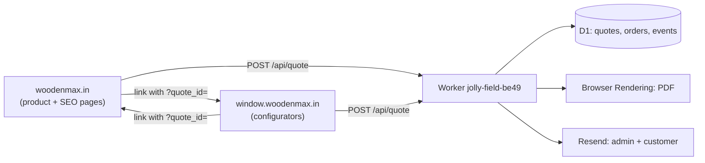

# Cross-domain quote spec — `window.woodenmax.in`

Ye document `window.woodenmax.in` repo ke liye hai. Wo alag repo hai, isliye uska code yahan se badla nahi ja sakta — par dono domains ko **ek hi quote aur order backend** use karna chahiye. Neeche wahi contract hai.

## Pehle ek zaroori fact

`localStorage` **per-origin** hota hai. `woodenmax.in` aur `window.woodenmax.in` alag origins hain, isliye aaj cross-domain cart **exist hi nahi karta** — jo bhi "mixing" dikhti thi wo ek hi origin ke andar thi. Iska matlab: cross-domain sharing sirf server ke through hi ho sakti hai, cookie ya storage ke through nahi.

Isliye plan simple hai: **`quote_id` hi handoff token hai.**

## Architecture



Dono domains apna cart client-side rakhte hain (fast UX ke liye), par **source of truth server hai**. Payment, PDF aur email sirf Worker se hote hain — kisi bhi domain me duplicate order logic nahi hona chahiye.

## Step 1 — `js/quote-store.js` copy karein

`js/quote-store.js` jaan-boojh kar dependency-free hai aur UMD pattern me likha hai. Use `window.woodenmax.in` me **jaisa hai waisa** copy karein. Kuch badalna nahi hai.

Kya milta hai:

- har item par `itemId` (UUID) — page, slug ya array index par koi keying nahi
- `add` / `update` par deep clone, aur andar rakhi copy deep-frozen
- versioned keys `wm_quote_items_v2` / `wm_quote_customer_v2` / `wm_quote_meta_v2`
- purane `woodenmax_quote_cart_v1` se ek-baar migration
- event bus: `ProductAdded`, `ProductUpdated`, `ProductRemoved`, `QuoteVersionBumped`

```html
<script defer src="/js/quote-store.js"></script>
```

## Step 2 — Item shape

Dono domains ko yahi shape bhejna hai. Extra fields allowed hain (server unhe store karta hai aur PDF me spec rows ki tarah print karta hai), par ye minimum chahiye:

```js
{
  itemId: "uuid",            // store khud daalta hai
  productKey: "sliding-window",
  productName: "3 Track Sliding Window",
  category: "Aluminium Windows",
  pageUrl: "https://window.woodenmax.in/configurator/sliding",
  area: "3000 × 1500 mm (48.4 sq.ft)",
  exactAmount: 52300,        // INR, pre-GST, INTEGER
  details: [                 // PDF me har row print hoti hai
    { label: "Width",    value: "3000" },
    { label: "Height",   value: "1500" },
    { label: "Quantity", value: "2" },
    { label: "Glass",    value: "8mm Toughened" },
    { label: "Colour",   value: "Matte Black" },
    { label: "Hardware", value: "Premium Imported" }
  ]
}
```

`details` me `Quantity` label zaroori hai — PDF usi se unit price nikaalti hai.

## Step 3 — Quote save karein

```
POST https://jolly-field-be49.finilexnaseem.workers.dev/api/quote
Content-Type: application/json

{
  "quote_id": "<store.meta().quoteId, ya null pehli baar>",
  "customer": { "name": "...", "mobile": "...", "email": "...", "city": "...", "pincode": "..." },
  "items": [ /* upar wali shape */ ],
  "source_url": "https://window.woodenmax.in/..."
}
```

Response:

```json
{ "success": true, "quote_id": "…", "quote_no": "WM-Q-2026-0007", "version": 3,
  "subtotal_inr": 377300, "gst_inr": 67914, "total_inr": 445214 }
```

Wahi `quote_id` dobara bhejne par **version badhta hai** aur purana version `quote_versions` me reh jaata hai. Naya quote number nahi banta. Isliye customer products badle to bhi history rehti hai.

## Step 4 — Handoff

Ek domain se doosre par bhejte waqt `quote_id` URL me daalein:

```
https://window.woodenmax.in/configurator?quote_id=<uuid>
```

Landing par:

```js
const incoming = new URLSearchParams(location.search).get('quote_id');
if (incoming && incoming !== WoodenMaxQuoteStore.meta().quoteId) {
  const res = await fetch(API + '/api/quote/' + incoming);
  const quote = await res.json();
  if (quote.success) {
    WoodenMaxQuoteStore.replaceAll(quote.items);
    if (quote.customer) WoodenMaxQuoteStore.setCustomer(quote.customer);
    WoodenMaxQuoteStore.setQuoteNo(quote.quote_no);
  }
}
```

`GET /api/quote/:id` response:

```json
{ "success": true, "quote_id": "…", "quote_no": "WM-Q-2026-0007", "version": 3,
  "customer": { }, "items": [ ], "subtotal_inr": 377300, "gst_inr": 67914, "total_inr": 445214 }
```

## Step 5 — Payment

`window.woodenmax.in` ko apna payment code **nahi** likhna chahiye. Wahi flow use karein:

```
POST /api/create-order    { purpose, quote_id }      → amount server D1 se nikaalta hai
POST /api/verify-payment  { razorpay_*, quote_id }   → order + PDF + email
GET  /api/order/:orderNo/pdf                         → customer download
```

`create-order` me `amount` bhejna bekaar hai — server use ignore karta hai. `order_full_pay` bina `quote_id` ke reject hota hai (`code: "QUOTE_REQUIRED"`).

## Step 6 — CORS

`worker/http.js` me allowed origins list hai:

```js
const ALLOWED_ORIGINS = [
  'https://woodenmax.in',
  'https://www.woodenmax.in',
  'https://window.woodenmax.in',
];
```

Naya subdomain add karein to yahin add karna hoga.

## Kya NAHI karna

- **Cookie se cart share karne ki koshish mat karein.** `woodenmax.in` par set ki gayi cookie subdomain par jaa sakti hai, par size limit 4 KB hai aur ek multi-product estimate usse bada ho jaata hai. `quote_id` (36 bytes) hi bhejein.
- **Dono domains me alag order logic mat rakhein.** PDF ka format, order number series aur email content ek hi jagah (`worker/`) se aane chahiye, warna dono jagah alag-alag PDF banengi.
- **Client par amount calculate karke server ko mat bhejein.** Server `items[].exactAmount` se khud jodta hai.
- **`itemId` khud mat banayein.** `store.add()` UUID assign karta hai; koi bhi `product-1`, `item-3` type id do pages par takra sakti hai — yahi asli mixing bug ki jad thi.

## Aage ka kaam (`window.woodenmax.in` repo me)

1. `js/quote-store.js` copy karke cart ko usi par migrate karna.
2. Landing par `?quote_id=` handoff wire karna (Step 4).
3. Apna payment code hata kar Worker ke `create-order` / `verify-payment` par shift karna.
4. `store.on('*')` se ek hi analytics event stream bhejna — yahi WEOS ke liye event backbone hai (`ProductAdded`, `QuoteVersionBumped`, aur server side ke `order_events`).
